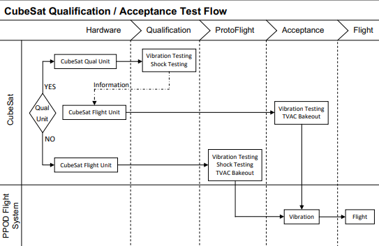

# Utah Tech CubeSat: Getting Started Guide
## Contents
* [Introduction](#introduction)
* [Project Management](#project-management)
* [Prerequisites](#prerequisites)
* [Tips](#tips)
## Introduction
Welcome to the Utah Water Resource Management CubeSat project! This guide will provide a comprehensive overview of the project, the CubeSat standard, our chosen subsystems, the development structure, prerequisites, and helpful resources. 

### Project Purpose
This CubeSat project aims to aid Utah's water resource management by providing valuable data for better decision-making in water allocation, conservation, and drought preparedness.

### What is a CubeSat?
A CubeSat is a type of miniaturized satellite built to standard dimensions using multiples of 10 cm x 10 cm x 11 cm cubic units. These small satellites provide a cost-effective platform for space research and technology demonstration. Learn more about CubeSats through these resources:

* [Wikipedia](https://en.wikipedia.org/wiki/CubeSat)
* [Cubesat 101](https://www.nasa.gov/wp-content/uploads/2017/03/nasa_csli_cubesat_101_508.pdf)

### CubeSat Standards

Our CubeSat will adhere to the 3U standard, with the following dimensions and limitations:

* **[CubeSat Design Specification](https://static1.squarespace.com/static/5418c831e4b0fa4ecac1bacd/t/62193b7fc9e72e0053f00910/1645820809779/CDS+REV14_1+2022-02-09.pdf)**

#### Qualification

### Our CubeSat: Subsystems

Our CubeSat comprises the following subsystems, each designed and developed independently:

* **Command:**
	* Handle Data
	* Store Data
* **Communication:**
	* Recieves Data
	* Transmits Data
* **Power:**
	* Generate Power(Solar Panels)
	* Store Power(Batteries)
	* Deliver Power(Fuses / Regulators)
* **Control** 
	* Determines Attitude(Orientation)
	* Controls Attitude(Orientation)
* **Payload:**
	* Creates Data
* **Structure:**
	* Supports Subsystems
* **Ground**
	* Tracks Cubesat
	* Transports Data

## Project Management
### Agile Development through Git and Markdown
We embrace an iterative and collaborative development approach using Git for version control and Markdown for documentation. Each subsystem team will maintain its repository and follow a standardized reporting structure:

Study: **[Report Document](./reports.md)**

Onshape: **[Onshape](https://cad.onshape.com/documents/c4e77bdcab1a7f0aa07b8b8b/w/ea53107cd727d7a4b10273b6/e/1b6fa754c8cf8c24668ebcda?renderMode=0&uiState=66c5ac7d0ce2432a1e3bed17)**

## Prerequisites
### Join the Discord:
1. Signup: **[Discord](https://discord.com/register)**
2. Join: **[UTAH TECH UNIVERSITY CUBE SAT Discord](https://discord.gg/ZNtuyNdY)**
3. Click: `UTAH TECH UNIVERSITY CUBE SAT`
4. Click: `Edit Server Profile`(In The Drop Down)
5. Change `Server Nickname` to full name

**If you have any issues communicate them using the discord for quick response.**

### Study Open Source CubeSat Resources:
Explore these resources for inspiration and insights from other CubeSat projects:
* [ORESAT](https://github.com/oresat)
* [QUETZAL-1](https://github.com/Quetzal-1-CubeSat-Team/quetzal1-hardware)
* [1K CUBE SAT](https://github.com/rgw3d/1KCubeSat_Hardware)
* [ARTEMIS](https://github.com/hsfl/artemis-hardware)

### Altium Designer:
Altium Designer is our preferred PCB design software.

* Apply: [Altium Education Student License](https://education.altium.com/) (One per subsystem is sufficient, but all members are encouraged to apply).
* Download: [Altium](https://www.altium.com/products/downloads)

Complete the Altium Designer Education course to gain proficiency in PCB design.

**Note:** If you encounter issues enrolling, click on a specific course unit (e.g. Unit 1 - Introduction to PCB Design) and then click "Enroll." 

We are excited to have you on board for this impactful project! If you have any questions, please don't hesitate to reach out to the team. Let's work together to contribute to Utah's sustainable water future! 

## Tips
### How should I start?
#### Function Report
* Use ChatGPT / Google Gemini to create using
* Study **[ASU Requirments Sheet](https://dixiestate-my.sharepoint.com/:x:/r/personal/d00441759_utahtech_edu/Documents/Attachments/phoenix_requirements.xlsx?d=wbb50e20101e141d7aacbf00c178bc9cd&csf=1&web=1&e=yVgcJd)**
#### Design Report
* Study other CubeSat Block Diagrams
	* [ORESAT Block Diagram](https://github.com/oresat/oresat.github.io/blob/master/pub/OreSat05_Block_Diagram.pdf)
	* [QUETZAL-1]
* Look at pre-built modules (e.g. Search `Sparkfun Brushless DC motor module`)
	* Spark Fun Boards
	* Adafruit boards
	* Development Boards
* Choosing ICs use
	* Manufacture Website (e.g. TI, STM, NXP) (These contain tables to sort)
	* Digikey
### Layout
* Study Application Note in Datasheet
* Look at pre-built modules (e.g. Search `Sparkfun Brushless DC motor module`)
	* Spark Fun Boards
	* Adafruit boards
	* Development Boards
### Subsystem Specific Tips
#### RF
* [Hackaday Talk](https://youtu.be/TnRn3Kn_aXg?si=ZT3tHDIVV4W_g0dA)
* [RF Design Tips](https://youtu.be/_Hfzq1QES-Q?si=JqdQ4bLXfTiugiWK)

### Preffered Manufactures
* MCU: STM
* Power ICs: TI
* Connectors: Samtec
* Capactiors/Inductors: Murata
* Resistor: Yaego
* Hardware(Standoffs / Nuts): RAF Electronic Hardware

AEQ-C 100 Preffered 

* All Capacitors are rated X7R 10 V 10 % GCM Murata
	* 0603 < 2.2 uF
	* 1206 < 22.0 uF
* All Resistors are 0603 .5% -55C - 155 C +- 25 ppm if possible

X7R 1059
X8G 1525
X8R 1772

GRM 18 8 Z7 1A 475 K E15 D
Ser LW T TM Vt CAP % 	 P

GCM