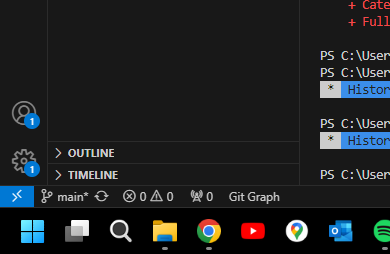

# Utah Tech CubeSat: Git Guide
##

## Prerequistes
### VS Code and Git:
1. Download: **[VS Code](https://code.visualstudio.com/download)**
2. Download: **[ Git](https://git-scm.com/download)**
3. Signup: **[Github](https://github.com/)** (Use University Email)
5. Send: `@RENO WARNER LINK TO GITHUB ACCOUNT` (Over Discord)
6. Study: [Markdown Cheat Sheet](https://www.markdownguide.org/cheat-sheet/)

## Setup
1. Clone: **[Repository](https://github.com/RENO-WARNER/UTAH-TECH-CUBESAT)**
2. Open Terminal: ``Ctrl + Shift + ` `` or `Terminal > New Terminal` (In Menu Bar)
3. Paste these commands seperately (With your name and email):
``` 
git config --global user.name "Your Name"
git config --global user.email "your.email@example.com" 
git config pull.rebase false
```
4. Sign in to Github using the bottom left user profile.

# Syncing
1. Click the sync button(Refresh button) in the bottom left to push your data and pull new data from the repository.



# Commiting
1. Edit any file
1. Save that file: `Ctrl + S` (It will highlight yellow with a M meaning Modifed)
3. Navigate to the Source Control Tab: `Ctrl + Shift + G` or `Clicking Side Tab`
4. Stage Changes(Pick )
5. Add Commit Message (e.g. Added my name to team.md / Added new function to report) (< 50 letters)
6. Commit using the Blue Commit Button

**If there is an issue with merging, let me know**

This is because another user as already edited the file you are trying to change. Usually merging both files will be all you need. 


